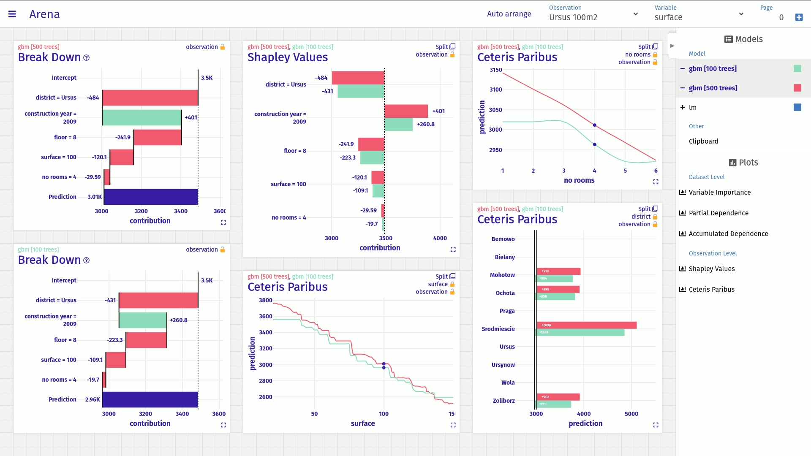

# Arena - Interactive XAI dashboard



## Examples
* [Apartments from 2009-2010 price per m2](https://arena.drwhy.ai/?demo=0)  
* [FIFA 20 Players value](https://arena.drwhy.ai/?demo=1)  
* [HR classification](https://arena.drwhy.ai/?demo=2)  

## How to use it
Arena dashboard is available at `https://arena.drwhy.ai`. All you need is to generate data.  
**R** - [ArenaR](https://github.com/piotrpiatyszek/ArenaR)

## Build

### Compiles and hot-reloads for development
```
npm install
npm run serve
```

### Compiles and minifies for production
Remember to set path in `vue.config.js`.
```
npm install
npm run build
```

## License

### Code
All scripts are licensed under the terms of the [GPL v3](LICENSE) license.

### Assets
**Fira Sans** - Files `src/assets/FiraSans-Bold.otf` and `src/assets/FiraSans-Regular.otf` are licensed under the terms of the [SIL OPEN FONT LICENSE Version 1.1](<src/assets/SIL Open Font License.txt>) license.
